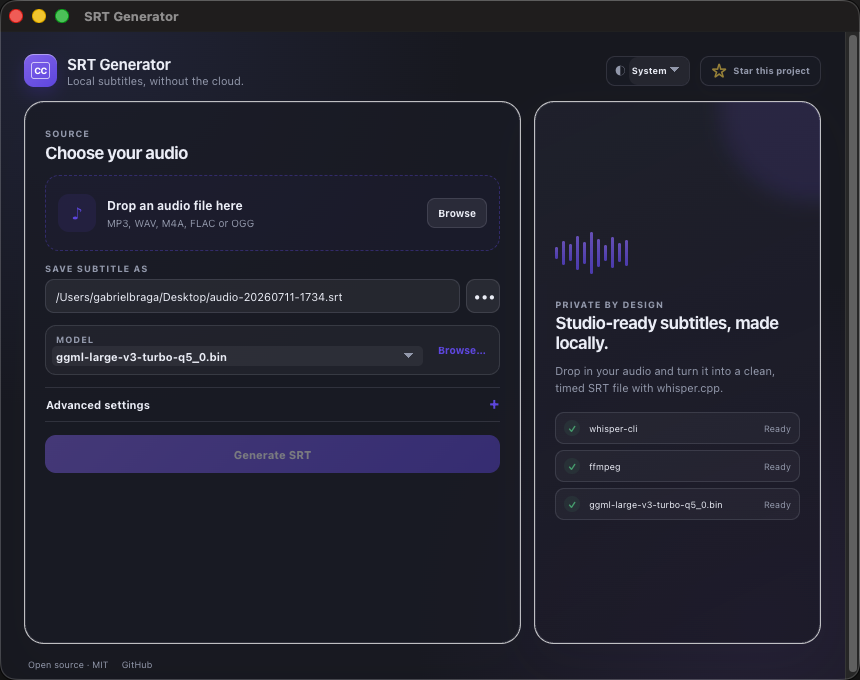

# SRT Generator

A small desktop app that turns audio into clean `.srt` subtitles with [whisper.cpp](https://github.com/ggml-org/whisper.cpp).

<p align="center">
  <strong>🔒 100% local transcription. Your audio never leaves your Mac.</strong><br>
  <sub>No uploads, accounts, subscriptions, or telemetry.</sub>
</p>



[Watch the 50-second demo](docs/srt-generator-demo.mp4)

## What it does

- Accepts MP3, WAV, M4A, FLAC, and OGG audio
- Generates and cleans timed SRT captions locally
- Supports multilingual and English-only Whisper models
- Lets you control language, line length, timing, vocabulary hints, and trailing silence
- Includes light and dark themes

## Requirements

- macOS (Apple Silicon is the first packaged target)
- [Homebrew](https://brew.sh/)
- Node.js 22.12 or newer, only when running from source

## Quick start

### 1. Install the local tools

```bash
brew install ffmpeg whisper-cpp
```

Confirm both commands are available:

```bash
ffmpeg -version
whisper-cli --help
```

### 2. Install a Whisper model

Models live in `~/.srt-generator/models`. The `base` model is a good first choice: it is small, multilingual, and fast enough for most personal use.

```bash
mkdir -p ~/.srt-generator/models
curl -L --fail --progress-bar \
  -o ~/.srt-generator/models/ggml-base.bin \
  https://huggingface.co/ggerganov/whisper.cpp/resolve/main/ggml-base.bin
```

Model suggestions:

| Model | Approx. size | Best for |
| --- | ---: | --- |
| `tiny` | 75 MB | Fast drafts and older Macs |
| `base` | 142 MB | Recommended starting point |
| `small` | 466 MB | Better accuracy, slower processing |
| `medium` | 1.5 GB | High accuracy on a capable Mac |

Replace `base` in both parts of the download command to install another model. See the [upstream model list](https://github.com/ggml-org/whisper.cpp/blob/master/models/README.md) for every available model. Files ending in `.en.bin` only support English.

> Advanced: set `SRT_GENERATOR_MODELS_DIR` before launching the app to use a different model folder. The default location is recommended because it keeps large models outside the Git repository.

### 3. Run from source

```bash
git clone https://github.com/bragabriel/srt-generator.git
cd srt-generator
npm install
npm run dev
```

Drop in an audio file, choose where to save the subtitle, and click **Generate SRT**.

## Build a macOS DMG

```bash
npm install
npm run dist:mac
```

The Apple Silicon DMG is created in `release/`. Builds made locally are not signed or notarized. If macOS blocks the app, right-click it and choose **Open**, then confirm once.

The app expects `ffmpeg`, `whisper-cli`, and at least one model to be installed on the destination Mac.

## Development

```bash
npm run dev       # Vite + Electron development mode
npm run build     # Type-check and build the renderer
npm run lint      # Static checks
npm test          # Unit tests
npm run dist:mac  # Build an Apple Silicon DMG
```

## Troubleshooting

### The app says `whisper-cli` or `ffmpeg` is missing

Run `brew install ffmpeg whisper-cpp`, then close and reopen SRT Generator. When launching from a GUI, Homebrew must be available in the app's environment.

### No model is detected

Check that the model ends in `.bin` and exists in the expected folder:

```bash
ls -lh ~/.srt-generator/models
```

You can also use **Browse…** in the app to select a model manually.

### Generation is slow

Start with `tiny` or `base`. Larger models trade speed and memory for accuracy.

## Privacy

Audio, models, generated subtitles, and technical prompts remain on your computer. SRT Generator does not include analytics or make network requests during transcription.

## Contributing

This is a small MIT-licensed project. If you find a bug or have a focused improvement, issues and pull requests are welcome at [bragabriel/srt-generator](https://github.com/bragabriel/srt-generator).

If the project is useful to you, you can also [star it on GitHub](https://github.com/bragabriel/srt-generator).

## License

[MIT](LICENSE)
